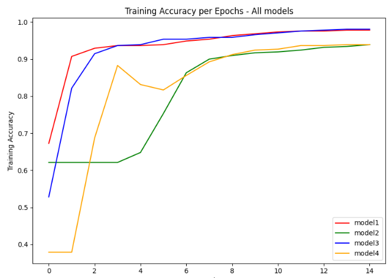
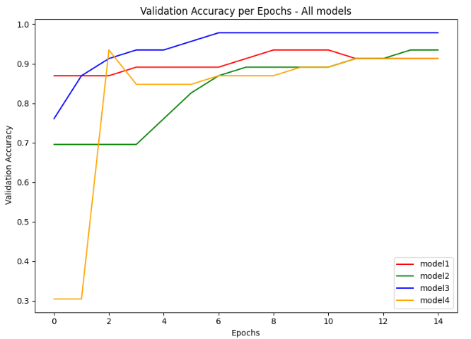
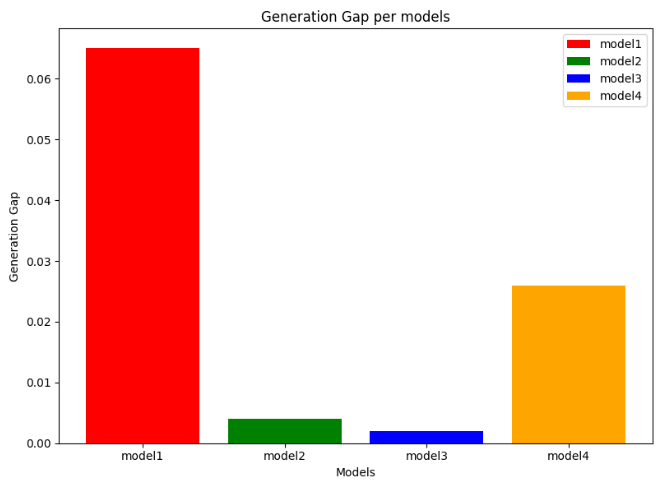

# Breast_Cancer_Classification_System_Using_ANN:-
- A neural network project that classifies breast cancer(Malignant and Benign) from the **breast_cancer** dataset using tensorflow/keras.
- Four dense(fully connected) neural networks with different activation functions and architecture are build,trained and compared to select the best-performing model.

## Overveiw:-
This project:
- Loads,visualizes and classifies the breast cancer dataset.
- Builds four feed-forward neural networks with different architectures(Relu vs Sigmoid activation function).
- Trains and evaluates all four models.
- Compares all models using training, testing and validation accuracy and also with generation gap and number of parameters.
- Selects the best model and analyze its predictons using confusion matrix and with sample prediction.

## Dataset:-
The [Wisconsin Breast_Cancer Dataset](https://archive.ics.uci.edu/dataset/17/breast+cancer+wisconsin+diagnostic) is loaded directly via 'sklearn.datasets.load_breast_cancer'. It consists of:
- 569 total samples (digitized FNA breast mass images).
- 30 numeric features → reduced to 25 after correlation-based feature selection.
- 455 training samples(shape=(455,25)).
- 114 testing samples(shape=(114,25)).
- 2 classes representing diagnosis: Malignant (0) and Benign (1).

## Model Archiecture:-
Below table shows the architecture of all four feed-forward neural networks.
The architecture is given in the format : Input layer-> Hidden layer-> Output layer.
| Layer | Model 1 | Model 2 | Model 3 | Model 4|
|---|---|---|---|---|
| Input | 25 | 25 | 25 | 25 |
| Flatten | 25 | 25 | 25 | 25 |
| Dense (Hidden 1) | 20 units, **ReLU**, L2 regularization | 20 units, **Sigmoid**, L2 regularization | 16 units, **ReLU** | 16 units, **Sigmoid** |
| Dense (Hidden 2) | 20 units, **ReLU**, L2 regularization | 20 units, **Sigmoid**, L2 regularization | 16 units, **ReLU** | 16 units, **Sigmoid** | 
| Dense (Output) | 2 units, Softmax | 2 units, Softmax | 2 units, Softmax | 2 units, Softmax |  

- From above table we cay that **Model 1** and **Model 2** has same number of neurons in both hidden layer i.e 20 neurons but with different activation functions and with applying L2 regularization at each hidden layer.
- Similarly with **Model 3** and **Model 4** has same number of neurons in both hidden layer i.e.16 neurons but with different activition functions and without applying l2 regularization at each hidden layer.

## Compilation Settings:-
- optimizer: adam()
- loss: sparse_categorical_crossentropy
- metrics: accuracy
- Random seed fixed at 42 for reproducibility

## Training Settings:-
- Model 1: 15 epochs,32 batch_size,10% validation_split,early_stopping callbacks
- Model 2: 15 epochs,32 batch_size,10% validation_split,early_stopping callbacks
- Model 3: 15 epochs,32 batch_size,10% validation_split
- Model 4: 15 epochs,32 batch_size,10% validation_split

## Model Comparison:
Below comparison matrix shows the parameters that are used to compare all four models.
The comprison matrix evaluates all four models on:
- **Training Accuracy**: it defines accuracy on the training dataset.
- **Validation Accuracy**: it defines how well our model is generalizing at the end of each epoch.
- **Generation Gap** (`Train Accuracy - Validation Accuracy`) : it can be used as a indicator for overfitting or underfitting.
- **Total Parameters**: it defines how much model is complex.

| Models| Training Accuracy | Validation Accuracy | Generation Gap | Total Parameters |
|---|---|---|---|---|
| model1 | 0.978 | 0.913 | 0.065 | 982 |
| model2 | 0.938 | 0.934 | 0.004 | 982 |
| model3 | 0.980 | 0.978 | 0.002 | 722 |
| model4 | 0.938 | 0.913 | 0.026 | 722 |

## Visualization Graphs:-
Below graph showcasts training, validation, testing accuracy per epoch and a generation gap per model.
- **Graph 1 : Training Accuracy per epoch**
>

- **Graph 2 : Validation Accuracy per epoch**
>

**From Graph 1 and Graph 2 :-**
- we can divide our model in two categories: activation function and number of parameters.
- **First in activation function, we observe that-**
  - Relu activation function has clearly outruns Sigmoid activation function with higher training and validation accuracy.
  - **Model1 and Model3** has high training and validation accuracy as compared to **Model 2 and Model 4**.
  - Between **Model1 and Model3** ,**Model3** has high training and validation accuracy with same activation function.

- **Second in number of parameters,we observe that:-**
  - **1.Fewer parameters, better performance:** **Model3** achieves the highest validation accuracy (97.8%) using only 722 parameters than **Model1 and Model2**, which have 982 parameters each. This shows that a higher parameter count does not necessarily lead to better performance.
  - **2.Same parameter count, different outcomes:** **Model3 and Model4** both have 722 parameters, yet **Model3's validation accuracy (97.8%)** is significantly higher than **Model4's (91.3%)**. This highlights that architecture design plays a more critical role than parameter count alone.

 - **Graph 3: Generation Gap per model**
>
- **From above graph we can conclude that:-**
  - The Generation Gap can be defined as difference between Training accuracy and Validation accuracy which can be used as an indicator of overfitting or underfitting.
  - Minimum the generation gap,best the model is.
  - Model3 also has the lowest generation gap (0.002) despite having the smallest number of parameters, making it the most efficient and best-generalizing model among the four.
    
    
